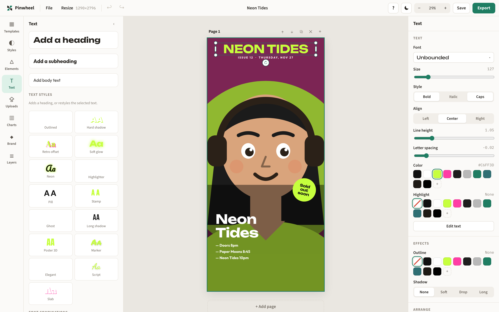

# Pinwheel Studio

**A free, open-source design studio that runs entirely in your browser.**
Social posts, thumbnails, decks, flyers and print, from thousands of editable
templates. No account, no server, no uploads: your files never leave your machine.

**Try it: [pinwheelstudio.org](https://pinwheelstudio.org)**

[](https://pinwheelstudio.org)

## Why Pinwheel

- **Local-first.** It is a static site. Every feature, including background removal,
  runs on your device. Nothing you make is sent anywhere.
- **Real templates, not pictures.** Over 8,000 templates across 72 formats, every
  one made of ordinary text, shapes and image frames you can edit, recolour and
  re-layout. Templates are generated from hand-built layouts, palettes, type
  pairings and copy packs, so swapping a palette or a font pairing restyles a whole
  design in one click.
- **Portable files.** A `.pinwheel` file is a zip with a JSON document and the
  original assets. Easy to share, diff, archive and open again later.
- **Installable and offline.** It is a PWA: install it to your dock, open it without a
  connection, and double-click `.pinwheel` files to open them in the studio.
- **Works on a phone.** The same app on a phone or tablet: the panels become bottom
  sheets, you drag and pinch on the canvas, and exports go to the share sheet.
- **Free to use, free to build on.** The app is MIT licensed and the presets are CC0,
  so designs you make from them are yours, with no attribution required.

## What you can do

| | |
|---|---|
| **Formats** | 72 sizes for Instagram, TikTok, YouTube, X, LinkedIn, Pinterest, Facebook, presentations, flyers, posters, A4 documents, menus, cards and more, plus custom sizes. Resize a design and it re-lays out for the new shape. |
| **Templates** | Searchable gallery with format and occasion filters. 19 occasions, from birthdays and weddings to Eid, Diwali, Christmas and memorials, each with its own palette and motifs. Apply a template to the current design or start from one. |
| **Text** | 49 Google Fonts in a picker that previews every family, 29 curated pairings, size, line height, tracking, bold, italic and caps, highlight, outline, soft, drop and long extruded shadows, and 15 one-click text styles. |
| **Shapes and lines** | 37 shapes, from rectangles and stars to hearts, speech bubbles, gears, ribbons and bolts, with fill, stroke, dashes and corner radius. Lines with arrowheads. |
| **Images** | Upload, paste or drag photos onto frames. Crop by zoom and focus point, masks, filter presets and adjustments, borders and shadows. On a cutout or transparent PNG the border and shadow follow the subject. |
| **Background removal** | One click, on your device, using an on-device neural network. The original is kept so you can restore it. |
| **Layout** | Snapping to page and element edges, alignment, grouping, box select, a layers panel with drag to reorder, hide and lock, and 150 steps of undo. |
| **Charts and QR codes** | Bar, line, pie and donut charts from a few lines of data, and QR codes for links. |
| **Brands** | As many brand kits as you like, switched from the home page. Each holds four colours, two fonts, a logo, saved colour schemes, saved text styles and a library of images that stay on your device. Build one from a logo: the studio reads its colours and offers several kits to pick from. Download a brand as one `.pinwheel` file and open it on another device. |
| **Recents** | The last 100 designs you touched, saved or not, with live thumbnails on the home page. Kept on your device until you clear the browser's site data. |
| **Export** | Multi-page PDF, PNG, JPG and SVG, with fonts embedded, at standard, high or print resolution. On desktop Chrome and Edge a real save dialog, and Save writes back to the file you opened; on phones the share sheet; elsewhere a download. |

The full product and technical spec is at [pinwheelstudio.org/spec.html](https://pinwheelstudio.org/spec.html).

## Running it yourself

You need [Node.js](https://nodejs.org) 20 or newer.

```sh
git clone https://github.com/theanam/pinwheel-studio.git
cd pinwheel-studio
npm install
npm run dev        # http://localhost:5185
```

To build a static site you can host anywhere:

```sh
npm run build      # → dist/
npm run preview    # serve the build locally
```

The build uses relative paths, so the same `dist/` works at a domain root, in a
subfolder such as `user.github.io/pinwheel/`, or from a plain file server.

### Self-hosting without third-party hosts

By default the app fetches five pinned libraries from jsDelivr on first use and the
background-removal model from Hugging Face the first time you need it. For an
air-gapped or privacy-strict deployment:

```sh
npm run build:offline
```

This downloads those files into `public/vendor`, points the app at the local copies
and removes the CDN and model hosts from the Content-Security-Policy. Google Fonts
stays remote in both modes, because `.pinwheel` files reference fonts by name rather
than embedding them. Exports always inline the fonts they use, so an exported PDF,
PNG or SVG is self-contained.

## The `.pinwheel` file

A `.pinwheel` file is a zip, and the manifest says what kind of thing is inside. A
design:

```
manifest.json     format, kind "design", version, size, page count, asset index
document.json     the document: pages, elements, theme
assets/           the original images, by id
thumbnail.png     a preview of the first page
```

A brand kit, as downloaded from the Brand panel:

```
manifest.json     format, kind "brand", version, asset index
brand.json        colours, fonts, logo id, colour schemes, text styles
assets/           the logo and every image saved to the brand
```

Opening either kind, from the Open button, a double-click or a drop onto the home
page, does the right thing: a design opens in the editor, a brand kit is added to
your brands. Files without a `kind` are version-1 designs.

The document model is declared in [`src/model.d.ts`](src/model.d.ts). Coordinates are
CSS pixels in page space, elements are a flat list per page in z-order, and every
colour in a template is a theme role, which is what makes one-click recolouring work.

## How the code is laid out

```
src/
  presets.js     Formats, palettes, type pairings, copy packs, layouts and the
                 template catalogue. Pure and deterministic, no DOM.
  render.js      Element model → React tree. The canvas, the gallery thumbnails
                 and every export go through it, so what you see is what you export.
  io.js          Export pipeline, .pinwheel pack and unpack, image import,
                 on-device background removal, and how files leave the app
                 (save dialog, share sheet or download).
  store.js       IndexedDB: recent designs, brands and settings.
  brand.js       Brand kits as data: defaults, migration, the kit file shape.
  palette.js     Colour kits from a logo's pixels. Pure.
  Studio.jsx     The editor: state, history, selection, pointer gestures,
                 snapping and panels. The only stateful module.
  StudioView.jsx Presentation only. Started as output from the design prototype
                 and is now maintained by hand.
  model.d.ts     The document model and .pinwheel manifest as types.
```

Dependencies run one way: `presets → render → io → editor`. The first two, and
`brand.js` and `palette.js`, never touch the DOM, which is what lets the template
checks and the brand tests run in Node without a browser.

`public/spec.html` is generated from the design prototype in `_source/`, and
`StudioView.jsx` started that way; see [`docs/PORTING.md`](docs/PORTING.md). UI
colours are tokens from `scripts/ui-tokens.js`, which is how dark mode is a palette
swap.

### Scripts

| Command | What it does |
|---|---|
| `npm run dev` | Development server on port 5185 |
| `npm run build` | Production build into `dist/`, with the PWA manifest and service worker |
| `npm run preview` | Serve the production build locally |
| `npm test` | Suggestion-ranking tests, brand and palette tests, and the template baselines |
| `npm run test:browser` | Drives headless Chrome through the home page, brand builder, recents, and the phone and tablet layouts (needs the dev server and a local Chrome) |
| `npm run typecheck` | `tsc --noEmit` against the model declarations |
| `npm run build:offline` | Vendor every third-party file and build with no external hosts |
| `npm run icons` | Regenerate the brand mark and PWA icons |

Two visual QA pages are served by the dev server: `/tests/contact-sheet.html` shows
live thumbnails of the whole catalogue, filterable by `?fmt=`, `layout=`, `per=` and
`pages=`, and `/tests/effects-sheet.html` shows every shape, the text shadow modes
and image borders and shadows around cutouts, with `?export=1` running it through
the export renderer too.

### Template baselines

Templates are generated from a few ingredient sets, so one layout edit can change
hundreds of designs at once. `npm test` builds one design per format and layout pair
and compares a hash against `tests/baselines/layouts.json`. When a change is
intentional:

```sh
npm run test:visual -- --update    # then commit tests/baselines/layouts.json
```

## Contributing

Bug reports and feature requests are welcome at
[github.com/theanam/pinwheel-studio/issues](https://github.com/theanam/pinwheel-studio/issues).
For pull requests, `npm test`, `npm run typecheck` and `npm run build` need to pass;
the GitHub Actions workflow runs the same three steps before deploying `main` to
GitHub Pages.

A few things to know before changing the code:

- **Templates** live in `src/presets.js`. Adding a layout, palette, pairing or copy
  pack adds every combination of them to the catalogue, so check the contact sheet
  and update the baselines.
- **The view is generated.** Change `_source/Pinwheel Studio.dc.html` and run
  `node scripts/dc-to-jsx.mjs` rather than editing `StudioView.jsx` directly.
- **Everything stays local.** Features must work without a server and must not send
  the user's documents or images anywhere. The analytics tag on pinwheelstudio.org
  is added by the deploy workflow and is not part of the source.

## Licence

Application code is [MIT](LICENSE). The presets, meaning the layouts, palettes, copy
packs and type pairings, are [CC0](LICENSE-PRESETS), so designs you make from them
are yours, with no attribution required. Third-party components are listed in
[THIRD-PARTY.md](THIRD-PARTY.md).
